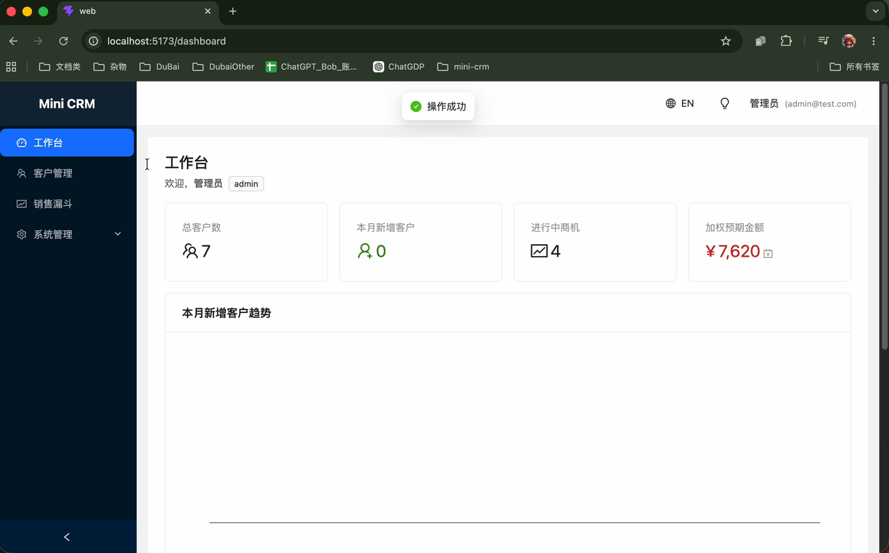

# Mini CRM

> 一个从零搭建的全栈中后台 demo —— Vue 3 + TypeScript + Hono + Drizzle + Turso

[](https://crm.bobodylan.com)
[](https://api.bobodylan.com/api/health)
[](#)

<p align="center">
  
</p>

## 🌐 在线体验

- **线上地址**：https://crm.bobodylan.com（自定义域，国内可直连）
- **默认账号**：`admin@test.com` / `123456`
- **测试角色**：admin 可看全部 / sales 受数据权限限制 / viewer 只读

> 前端 Cloudflare Pages + 后端 Cloudflare Workers + 数据库 Turso，整套都在 CF 边缘节点，**0 ms 冷启动 + 中国大陆可直接访问**。

> 备用 demo：https://mini-crm-seven-steel.vercel.app （海外节点 Vercel + Render，部分网络环境可能慢/不通）

## ✨ 核心功能

| 模块 | 功能 |
|---|---|
| **登录鉴权** | JWT + axios 拦截器 + 路由守卫 + F5 验签 |
| **客户管理** | 大表格 + 多字段筛选 / 排序 / 分页 + Schema 驱动的 BasicForm + Excel 导出 |
| **联系人 / 跟进** | 一客户多联系人主从表 + Markdown 跟进记录时间线 |
| **销售漏斗看板** | vuedraggable 4 列拖拽 + ⭐ **乐观更新 + 失败回滚** + 标记丢失 |
| **三级权限** | RBAC 角色 + v-auth 指令（按钮级）+ 路由 meta（页面级）+ 权限中间件（接口级）+ ⭐ **数据权限**（基于 ownerId） |
| **角色 / 用户管理** | 内置 admin / sales / viewer 三角色 + 用户 CRUD + ⭐ **自锁防御**（不能删自己、不能改自己角色） |
| **工作台仪表盘** | ECharts 折线 / 漏斗 / 横向柱状三图 + 4 项核心指标卡片 + 角色差异化数据 |
| **国际化** | vue-i18n 中英双语 + Ant Design Vue locale 联动切换 |
| **暗黑模式** | Ant Design Vue 内置 darkAlgorithm + useToken() 联动自定义 DOM 颜色 |
| **生产部署** | ⭐ Cloudflare Pages（前端）+ Cloudflare Workers（后端）+ Turso（云上 SQLite）+ 自定义域 `bobodylan.com`，全球边缘节点，**大陆可直连** |

## 🛠 技术栈

### 前端 `web/`

| | |
|---|---|
| 框架 | Vue 3.5 + `<script setup>` + Composition API |
| 构建 | Vite 8 |
| 语言 | TypeScript 6 |
| UI 库 | Ant Design Vue 4 |
| 状态管理 | Pinia + pinia-plugin-persistedstate |
| 路由 | Vue Router 4 |
| HTTP | axios |
| 图表 | ECharts 6 |
| 拖拽 | vuedraggable@next（v4） |
| Markdown | md-editor-v3 |
| 国际化 | vue-i18n 11 |

### 后端 `api/`

| | |
|---|---|
| Web 框架 | Hono（**跨 runtime 设计**：同一份代码同时跑 Node.js 和 Cloudflare Workers） |
| 运行时 | Cloudflare Workers（生产）/ Node.js + @hono/node-server（本地 dev 备选） |
| ORM | Drizzle ORM |
| 数据库 driver | @libsql/client（本地 file: / 生产 Turso 同套代码） |
| 校验 | Zod |
| 鉴权 | **hono/jwt**（Web Crypto API，Workers 原生兼容）+ bcryptjs |
| 开发 | wrangler dev（本地模拟 Workers runtime）/ tsx watch（Node 本地快迭代） |

### 部署

| | |
|---|---|
| 前端 | **Cloudflare Pages**（边缘节点，自定义域 `crm.bobodylan.com`） |
| 后端 | **Cloudflare Workers**（0 ms 冷启动，自定义域 `api.bobodylan.com`） |
| 数据库 | Turso（云上 SQLite） |
| 备份部署 | Vercel + Render free tier（最初部署方案，海外节点） |

## 🚀 本地启动

### 前置要求

- Node.js 18+
- npm

### 步骤

```bash
# 1. 克隆
git clone https://github.com/bobo0318/mini-crm.git
cd mini-crm

# 2. 后端
cd api
cp .env.example .env       # 看 .env 配 JWT_SECRET / DATABASE_URL 等
npm install
npm run db:push            # 建表（本地 SQLite 文件 mini-crm.db）
npm run db:seed            # 塞内置角色 + 测试数据
npm run dev                # http://localhost:3000

# 3. 前端（开新终端）
cd ../web
npm install
npm run dev                # http://localhost:5173
```

### 创建管理员账号

后端跑起来后，用任意工具调用注册接口：

```bash
curl -X POST http://localhost:3000/api/auth/register \
  -H "Content-Type: application/json" \
  -d '{"email":"admin@test.com","password":"123456","name":"管理员"}'
```

新注册的用户默认 `sales` 角色。打开 Drizzle Studio (`npm run db:studio`) 把 `users.role_id` 改成 `1`（admin）即可。

## 📁 项目结构

```
mini-crm/
├── web/                          ← 前端
│   ├── src/
│   │   ├── api/                  ← 所有接口封装
│   │   ├── components/BasicForm/ ← Schema 驱动的通用表单组件
│   │   ├── composables/          ← useChart 等 composable
│   │   ├── directives/           ← v-auth 自定义指令
│   │   ├── layouts/              ← MainLayout（顶栏 + 侧栏 + router-view）
│   │   ├── locales/              ← zh-CN / en 语言包
│   │   ├── router/               ← routes + guards 拆分
│   │   ├── stores/               ← Pinia user / settings
│   │   ├── utils/                ← axios 封装 / Excel 导出 / 时间格式
│   │   └── views/                ← 业务页面（按模块分目录）
│   ├── .env.development          ← 本地 API 走 Vite proxy
│   ├── .env.production           ← 生产 API URL
│   └── vite.config.ts
│
└── api/                          ← 后端
    ├── src/
    │   ├── db/
    │   │   ├── schema.ts         ← 6 张表的 Drizzle schema
    │   │   ├── client.ts         ← libsql 单例
    │   │   └── seed.ts           ← 角色种子脚本
    │   ├── middlewares/
    │   │   ├── auth.ts           ← JWT 校验 + 挂 role/permissions
    │   │   └── permission.ts     ← 权限码检查
    │   ├── routes/               ← auth / customer / contact / followUp / deal / role / user / stats / me
    │   ├── utils/                ← jwt / password
    │   └── index.ts              ← Hono 入口
    ├── .env.example
    └── test.http                 ← REST Client 接口测试集合
```

## 🎯 项目亮点（面试可讲的故事）

### 1. JWT 鉴权完整闭环
登录拿 token → axios 请求拦截器自动注入 Authorization → 响应拦截器统一处理 401 跳登录页（带 redirect 回跳）→ F5 后路由守卫调 `/api/me` 验签防 localStorage 伪造。

### 2. Schema 驱动的通用表单 BasicForm
`v-model:modelValue` + `<component :is>` 动态组件 + `defineExpose` 暴露 validate/resetFields。客户 / 联系人 / 商机 / 用户 4 个弹窗共享一份组件。

### 3. 销售漏斗看板：乐观更新 + 失败回滚
拖完瞬间本地改 `deal.stage` + 调接口；失败时**字段值回滚 + 把卡片从目标列 splice 出来 push 回源列**。

### 4. 三级权限 + 数据权限
- **路由级**：`meta.permission` + 守卫
- **按钮级**：`v-auth` 自定义指令 mounted 时直接从 DOM 移除
- **接口级**：`permission()` 工厂中间件
- **数据级**：customer/deal 的 update 接口在 permission 之外额外检查 ownerId（admin 全开 / sales 必须 ownerId === userId）

### 5. 自锁防御 2 条
- 不能删除自己（DELETE /users/:id 拦截 id === userId）
- 不能修改自己的角色（编辑自己时角色 Select disabled + 后端 PUT 拦截）

### 6. ECharts + Vue 3 整合
封装 `useChart` composable 统一管 init / setOption / resize / dispose 生命周期。ECharts 实例用 `shallowRef`（深度响应式会拖累性能）。

### 7. 暗黑模式不维护两套 CSS
用 AD Vue 4 内置 `darkAlgorithm` 一键切组件主题；手写 DOM 用 `theme.useToken()` 拿 token 绑 inline style 自动跟。

### 8. 一套代码本地 + 云端通用
后端 `@libsql/client` 同时支持 `file:` 本地协议和 `libsql://` Turso 远程协议，通过环境变量切换。

### 9. 从 Node.js / Render 迁移到 Cloudflare Workers（解决大陆访问 + 0 ms 冷启动）
首版部署 Vercel + Render free tier 在大陆访问不稳（Render 冷启动 30-50 秒 + onrender.com 部分 IP 被墙）。
- 后端从 Node.js + @hono/node-server 迁到 **Cloudflare Workers**：拆 `app.ts`（runtime 无关业务）/ `index.ts`（Workers 入口）/ `node-dev.ts`（Node 本地入口 fallback），同一份业务代码两个 runtime 通跑
- JWT 从 `jsonwebtoken`（Node crypto 同步）换 **`hono/jwt`（Web Crypto 异步）** 兼容 Workers
- db client 改"Proxy 懒初始化"避开 Workers 模块加载时机问题（路由层完全不动）
- 前端从 Vercel 迁到 **Cloudflare Pages**，绑自定义域 `crm.bobodylan.com` / `api.bobodylan.com`
- 最终：**整套都在 CF 边缘节点，0 ms 冷启动 + 大陆直连**，Render 冷启动 + 海外 IP 被墙的双重问题彻底解决

## 📚 学习路径（D0 - D12 + 后端 runtime 迁移）

```
D0  项目立项 + 14 天开发计划
D1  Vite + Vue 3 + TS 前端脚手架
D2  Hono + Drizzle + SQLite 后端 + 前后端 hello world
D3  ⭐ 登录鉴权全链路（JWT + 拦截器 + 路由守卫）
D4-D5 客户管理 CRUD + BasicForm + Excel 导出
D6  联系人 + Markdown 跟进记录
D7-D8 销售漏斗 Kanban + vuedraggable + 乐观更新
D9  ⭐ 权限三级控制（RBAC）
D10 工作台仪表盘（ECharts 三图）
D11 国际化 + 暗黑模式
D12 部署上线 v1（Vercel + Render + Turso）+ README
D12+ ⭐ 部署上线 v2（Cloudflare Pages + Workers + Turso + 自定义域 bobodylan.com，解决大陆访问）
```

详见 [`PROJECT_PLAN.md`](PROJECT_PLAN.md)。

## 📝 License

MIT

---

**项目作者**：bobo0318 ｜ [GitHub](https://github.com/bobo0318/mini-crm)
